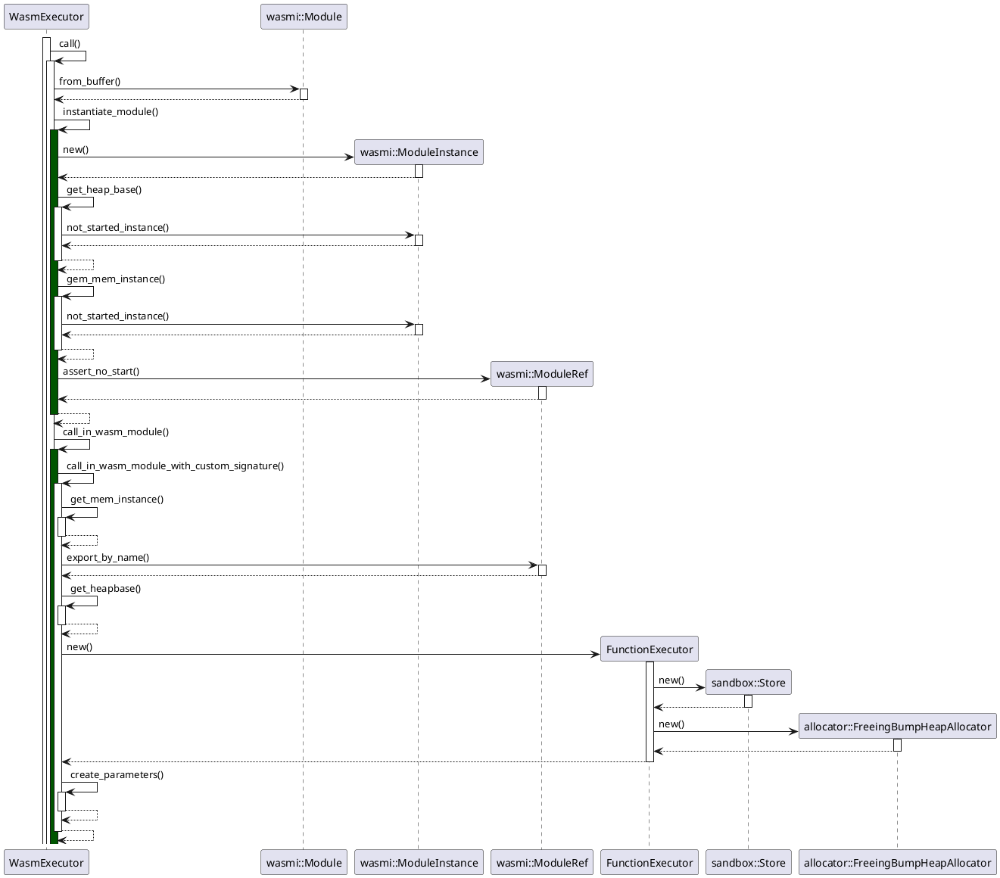

### uml: class diagram

    class $wasm_exec {
        // Executes the provided code in a sandboxed wasm runtime
        ==
        + new()
        + call()
        + call_with_custom_signature()
        + get_mem_instance()
        + get_heap_base()
        + call_in_wasm_module()
        + call_in_wasm_module_with_custom_signature()
        + instantiate_module()
    }